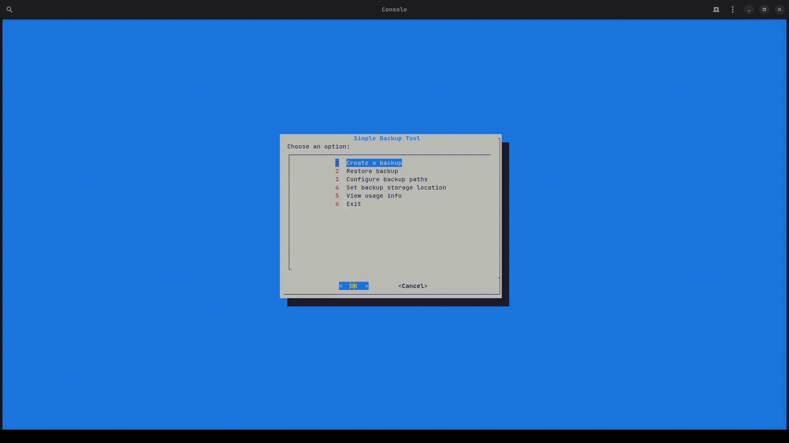

# Simple Backup Tool (sbt)
A lightweight Linux utility written in Bash for creating and restoring encrypted backups using `tar.xz` and GPG.

## Features
- Create compressed and encrypted backups of specified paths.
- Restore backups to a user-defined location.
- Configure backup paths and storage location via an interactive `dialog`-based interface.
- Log operations to a file for debugging and tracking.

## Installation
1. Clone the repository:
   ```bash
   git clone https://github.com/alinskij/sbt.git
   ```
2. Copy the script to `/usr/local/bin`:
   ```bash
   cd sbt; sudo cp sbt /usr/local/bin/sbt; sudo chmod +x /usr/local/bin/sbt
   ```
3. Ensure dependencies are installed (see below).

## Dependencies
- `bash`
- `dialog`
- `tar`
- `xz`
- `gpg`

## Usage
Run the tool:
```bash
sbt
```

### Menu Options
1. **Create a backup**: Back up configured paths to an encrypted `.tar.xz.gpg` file.
2. **Restore backup**: Restore a selected backup to a specified directory.
3. **Configure backup paths**: Edit paths to back up (one per line).
4. **Set backup storage location**: Set the directory for storing backups.
5. **View usage info**: Display usage information and GPG setup tips.
6. **Exit**: Quit the tool.

### Configuration
- Backup paths are stored in `~/.config/sbt/backup_paths`.
- Storage location is set in `~/.config/sbt/storage_path`.
- Logs are written to `~/.config/sbt/sbt.log`.
- Created backups are tracked in `~/.config/sbt/created_backups`.

### GPG Setup
Ensure you have a GPG key configured for encryption. See the [Arch Linux GnuPG guide](https://wiki.archlinux.org/title/GnuPG) for details.

## License
This project is licensed under the MIT License. See the [LICENSE](LICENSE) file for details.

## Contributing
Contributions are welcome! Please submit issues or pull requests on GitHub.
